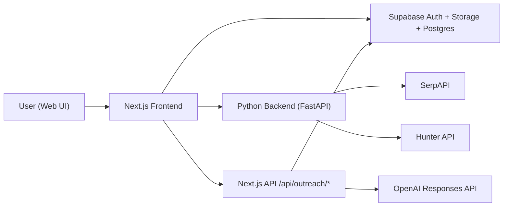

# Lead Discovery Agent

AI-assisted lead discovery and outreach platform:
- discover engineering/hiring contacts for a target company
- infer/propose professional emails
- generate personalized outreach drafts from user resume + job description
- manage usage with credits and quotas

## Highlights

- Company + LinkedIn lead discovery pipeline (Python FastAPI backend)
- Supabase auth (email + Google)
- Resume upload and profile management
- Job-description context workflow
- AI draft generation with confirmation before send
- Credits + usage controls for monetization
- Per-user persisted workspace state (session isolation)

## Architecture



## Monorepo Structure

```text
New project/
├── docs/
│   └── review-guidelines.md
├── lead_agent/                 # Python backend (FastAPI + CLI)
├── lead_agent_ui/              # Next.js frontend + outreach API routes
├── AGENTS.md
├── DEPLOYMENT.md
└── README.md
```

## Quick Start

### 1) Backend
Follow:
- `/Users/varunsavai/Documents/New project/lead_agent/README.md`

### 2) Frontend
Follow:
- `/Users/varunsavai/Documents/New project/lead_agent_ui/README.md`

### 3) Supabase SQL setup
Run these scripts in Supabase SQL editor:
1. `/Users/varunsavai/Documents/New project/lead_agent_ui/docs/supabase_outreach_drafts.sql`
2. `/Users/varunsavai/Documents/New project/lead_agent_ui/docs/supabase_outreach_base_drafts.sql`
3. `/Users/varunsavai/Documents/New project/lead_agent_ui/docs/supabase_credits.sql`

## Environment Variables (Summary)

### Backend (`lead_agent/.env`)
- `SERPAPI_KEY`
- `HUNTER_API_KEY`
- `FRONTEND_ORIGINS`

### Frontend (`lead_agent_ui/.env.local`)
- `NEXT_PUBLIC_SUPABASE_URL`
- `NEXT_PUBLIC_SUPABASE_ANON_KEY`
- `NEXT_PUBLIC_LEAD_API_URL`
- `OPENAI_API_KEY`
- `OPENAI_MODEL`
- `DRAFTS_DAILY_LIMIT`

## Screenshots

Add screenshots to show:
1. Sign-in page
2. Lead discovery dashboard
3. Agent progress + grouped leads
4. Resume/profile page
5. Draft review modal

Example markdown format:
```md

```

## Security

- Never commit real `.env` or `.env.local` values.
- Rotate API keys if exposed.
- Keep LLM keys server-side only.

## CI: Automated Tests on Push

GitHub Actions workflow file:
- `/Users/varunsavai/Documents/New project/.github/workflows/tests.yml`

It runs automatically on:
- every `push`
- every `pull_request`
- manual trigger from Actions tab (`workflow_dispatch`)

Jobs:
1. Backend: installs Python deps from `lead_agent/requirements.txt` and runs `pytest -q`
2. Frontend: installs Node deps from `lead_agent_ui/package-lock.json` and runs `npm run test:run`

## Branch Protection (Block Merge Unless Tests Pass)

Follow:
- `/Users/varunsavai/Documents/New project/docs/github-branch-protection.md`

This protects `main` by requiring pull requests and passing checks:
- `Backend (pytest)`
- `Frontend (vitest)`

## Documentation

- Deployment: `/Users/varunsavai/Documents/New project/DEPLOYMENT.md`
- Backend details: `/Users/varunsavai/Documents/New project/lead_agent/README.md`
- Frontend details: `/Users/varunsavai/Documents/New project/lead_agent_ui/README.md`
- Review standards: `/Users/varunsavai/Documents/New project/docs/review-guidelines.md`
- GitHub branch protection: `/Users/varunsavai/Documents/New project/docs/github-branch-protection.md`
